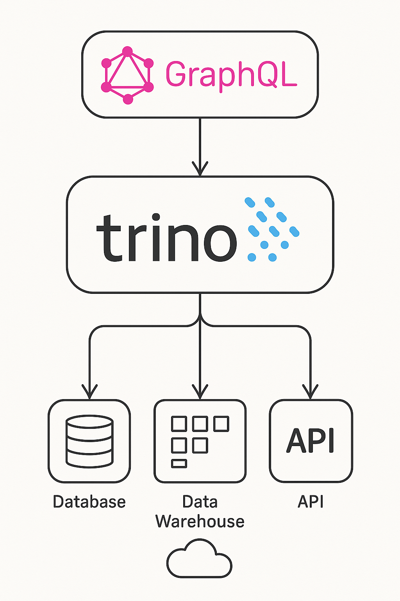

# Trino GraphQL

[](https://www.apache.org/licenses/LICENSE-2.0.txt)


[](https://sonarcloud.io/summary/new_code?id=iromu_graphql-trino)
[](https://repo1.maven.org/maven2/org/iromu/trino/)
[](https://central.sonatype.com/service/rest/repository/browse/maven-snapshots/org/iromu/trino/)
[](https://securityscorecards.dev/viewer/?uri=github.com/iromu/graphql-trino)

A Spring Boot application that dynamically generates a GraphQL schema from Trino catalogs, schemas, and tables. It
allows users to explore and query Trino data sources using GraphQL without manually writing schema definitions.



## 🚀 Features

- **Dynamic GraphQL Schema**: Automatically scans Trino catalogs, schemas, and tables and exposes them as GraphQL
  queries.
- **Auto-detect Columns**: Generates GraphQL object types from Trino table column metadata.
- **Filter Support**: Query data with dynamic filters using GraphQL input arguments.
- **Streamed Results**: Efficient streaming of query results from Trino using JDBC.
- **GraphiQL Interface**: Visual GraphQL playground is exposed at the root URL `/` for easy testing and exploration.
- **Export Schema**: Exposes a REST endpoint to download the auto-generated GraphQL schema in SDL format.

## 🧠 How It Works

1. On startup, the app connects to Trino via JDBC.
2. It fetches available catalogs, schemas, tables, and columns.
3. GraphQL schema is dynamically generated using this metadata.
4. Each table is exposed as a top-level query.
5. Query fields support filters using a generic `FilterInput` object.
6. Queries return streamed `Map<String, Object>` rows to minimize memory usage.

## 🔧 Configuration

Set up your connection to Trino in `application.yml` or `application.properties`:

```yaml
spring:
  datasource:
    url: jdbc:trino://localhost:8080
    username: your-trino-user
    driver-class-name: io.trino.jdbc.TrinoDriver
```

## ⚙️ Application Configuration (`app.*`)

The application supports flexible configuration via `application.yml` or `application.properties`, using the `app`
prefix. These properties control how GraphQL schemas are generated from Trino catalogs.

### Available Configuration Options

| Property                                   | Default Value            | Description                                                                                                                               |
|--------------------------------------------|--------------------------|-------------------------------------------------------------------------------------------------------------------------------------------|
| `app.schema-folder`                        | `/etc/schema`            | Filesystem path where the fetched Trino schemas will be stored.                                                                           |
| `app.replace-objects-name-characters`      | `false`                  | Whether to automatically replace invalid characters in GraphQL object names.                                                              |
| `app.ignore-objects-with-wrong-characters` | `true`                   | If `true`, skips any object whose name contains invalid GraphQL characters.                                                               |
| `app.ignore-cache`                         | `false`                  | Disables caching if set to `true`. Schema metadata will be reloaded on every run.                                                         |
| `app.include-catalogs`                     | _empty_                  | A list of catalogs to include explicitly in the schema generation process. If empty, all catalogs are considered (except those excluded). |
| `app.exclude-catalogs`                     | `["system"]`             | Catalogs to exclude from processing. Useful for avoiding system/internal catalogs.                                                        |
| `app.exclude-schemas`                      | `["information_schema"]` | Schemas to ignore across any catalog. Prevents processing metadata tables.                                                                |

### Example (`application.yml`)

```yaml
app:
  schema-folder: /tmp/schema
  replace-objects-name-characters: true
  ignore-objects-with-wrong-characters: false
  ignore-cache: true
  include-catalogs:
    - my_catalog
  exclude-catalogs:
    - system
  exclude-schemas:
    - information_schema
    - pg_catalog
```

### 🐳 Overriding Configuration via Docker Environment Variables

Spring Boot automatically maps environment variables to configuration properties using a relaxed binding system. This
means all the `app.*` properties can be overridden via Docker environment variables using the following rules:

- Dots (`.`) in property names become underscores (`_`)
- Everything is **uppercased**
- Prefix with `APP_` for properties under `app`

#### 🧪 Example Mappings

| Property Name                              | Environment Variable                       |
|--------------------------------------------|--------------------------------------------|
| `app.schema-folder`                        | `APP_SCHEMA_FOLDER`                        |
| `app.replace-objects-name-characters`      | `APP_REPLACE_OBJECTS_NAME_CHARACTERS`      |
| `app.ignore-objects-with-wrong-characters` | `APP_IGNORE_OBJECTS_WITH_WRONG_CHARACTERS` |
| `app.ignore-cache`                         | `APP_IGNORE_CACHE`                         |
| `app.include-catalogs[0]`                  | `APP_INCLUDE_CATALOGS_0`                   |
| `app.exclude-catalogs[0]`                  | `APP_EXCLUDE_CATALOGS_0`                   |
| `app.exclude-schemas[1]`                   | `APP_EXCLUDE_SCHEMAS_1`                    |

> ✅ Arrays/lists are supported by indexing: `APP_INCLUDE_CATALOGS_0`, `APP_INCLUDE_CATALOGS_1`, etc.

---

#### 🐳 Docker `environment` Example (in `docker-compose.yml`)

```yaml
services:
  graphql-trino:
    image: iromu/graphql-trino:latest
    environment:
      - APP_SCHEMA_FOLDER=/tmp/schema
      - APP_REPLACE_OBJECTS_NAME_CHARACTERS=true
      - APP_IGNORE_OBJECTS_WITH_WRONG_CHARACTERS=false
      - APP_IGNORE_CACHE=true
      - APP_INCLUDE_CATALOGS_0=my_catalog
      - APP_EXCLUDE_CATALOGS_0=system
      - APP_EXCLUDE_SCHEMAS_0=information_schema
      - APP_EXCLUDE_SCHEMAS_1=pg_catalog
```

## 🧪 Example GraphQL Query

```graphql
query {
    my_table(limit: 10, filters: [
        { field: "age", operator: "gt", intValue: 30 },
        { field: "name", operator: "like", stringValue: "Ali" }
    ]) {
        id
        name
        age
    }
}
```


